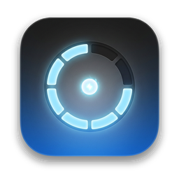

# respawken

<p align="center">
  
</p>

A tiny macOS status bar app that shows how much Claude Code, Codex, Cursor, Notion AI, and
Antigravity usage you have left, and when each limit resets.

It answers two questions at a glance:

- **When do my limits reset?**
- **How much usage do I have left?**

Native Swift/SwiftUI, no Dock icon, ~22 MB resident, idle at 0% CPU.


The menu bar icon is stacked meters — configured Claude accounts, then Codex, Cursor,
Notion AI, and Antigravity, top to bottom. Fill is utilization, colour is severity (green / amber / red). A
provider that is signed out or failing renders as an empty outline, so a missing reading never
looks like a healthy zero.

Open the menu extra for a labeled Overview of those same meters. Click a row
to see that product's full windows (Claude stacks every account). The panel
reopens on Overview.

Open **Settings** from the gear on the panel to add or edit Claude accounts (label + config dir),
and to change the keyboard shortcut that toggles the panel (default **⌃⌥U**).
Defaults match Personal (`~/.claude`) and Work (`~/.claude-oxp`). Changes persist under
`~/Library/Application Support/Respawken/settings.json`.

Claude and Notion default to **Now burning**: the Overview meter follows included usage,
then credits once that cap is gone. Session / 6-hour stay as pins if you pick them.
Cursor's three windows (Cursor Models, Other Models, On-demand) are static picks.
If the metered window has no reset time, Overview still shows `resets in …` from the
soonest sibling window, or the plan renewal for usage credits.

## Run it

```sh
./build.sh --run
```

That produces `dist/Respawken.app` and launches it. First launch registers it as a login item
(Settings can turn that off). If you move the bundle, toggle Launch at login off and on so
macOS picks up the new path.

Two extra modes are useful when something looks wrong:

```sh
./build.sh && ./dist/Respawken.app/Contents/MacOS/Respawken --probe     # print live values
./dist/Respawken.app/Contents/MacOS/Respawken --preview /tmp/panel.png  # render the UI to a PNG
```

## Where the numbers come from

Everything is read on-device from credentials the tools already store. respawken never asks you to
log in again. The only thing it stores of its own is the Claude account list (and a small
notification bookkeeping key in UserDefaults).

| Provider | Source | Notes |
| --- | --- | --- |
| **Codex** | `~/.codex/auth.json` → `chatgpt.com/backend-api/wham/usage` | Access tokens expire; respawken refreshes them via `auth.openai.com/oauth/token` and writes the rotated tokens back so Codex stays in sync. Plus accounts show a 5-hour session window plus weekly; plans that only have weekly still show that one window. Falls back to the `rate_limits` block in the newest session log under `~/.codex/sessions` or `archived_sessions` when the API is unreachable or refresh fails. |
| **Cursor** | `state.vscdb` → `cursor.com/api/usage-summary` | Reuses the bearer token Cursor.app already holds, so no browser cookie decryption. Cursor bills monthly, so "resets" is the end of the billing cycle. Cursor Models and Other Models are percent gates; on-demand (when enabled) is a dollar cap in cents. |
| **Claude Code** | Per-account: default `~/.claude` → `Claude Code-credentials`; custom `CLAUDE_CONFIG_DIR` → `Claude Code-credentials-<sha256[:8]>` (or `$dir/.credentials.json`) → `api.anthropic.com/api/oauth/usage` | Multiple logins via Settings (label + config dir). Defaults: Personal on `~/.claude`, Work on `~/.claude-oxp`. Access tokens expire after ~8 hours; respawken refreshes them via `platform.claude.com/v1/oauth/token` and writes the rotated tokens back so Claude Code stays in sync. The usage endpoint returns no account email — rows use your labels. Team extra budget is **usage credits** (`spend`, with legacy `extra_usage` as fallback). |
| **Notion AI** | Notion.app Cookies + Keychain `Notion Safe Storage` → `app.notion.com/api/v3/getCreditRateLimitStatus` (+ `getAIUsageEligibilityV2` for credits) | Decrypts the desktop app's `token_v2` session cookie (via `/usr/bin/security`, same prompt avoidance as Claude). Tracks the fixed 6-hour and monthly AI usage allowance on Business/Enterprise, plus Notion credits balance. These are Notion's private web APIs — not the public Connection/PAT surface — and can change without notice. |
| **Antigravity** | Running `agy` loopback, else Keychain `gemini`/`antigravity` → `cloudcode-pa.googleapis.com/v1internal:retrieveUserQuotaSummary` | Gemini and Claude/GPT each have a weekly + 5-hour window, the same groups `/usage` shows. Prefers the CLI's local language server when `agy` is open (no CSRF, self-signed loopback). Otherwise reuses the consumer OAuth session `agy` already stored (`go-keyring-base64` blob, read via `/usr/bin/security`). Access tokens last about an hour; respawken refreshes them and writes the rotated tokens back so the CLI stays in sync. |

Providers are polled every 2 minutes, concurrently, with a 12-second timeout each. The cadence
drops to 30 seconds only while a window is still burning (**90–98%**) or a reset is within
10 minutes — sitting at 99–100% with hours left stays on the 2-minute poll. One provider
being slow or signed out never blocks the others.

### Notifications

On first launch macOS will ask for notification permission. When allowed, respawken posts
Notification Center alerts when any active window hits **≥98%** used, when a weekly or
monthly window is on track to empty before it resets, and schedules an alert for
each window's reset time (the same timestamp that drives the “resets in …” countdown). Shared
reset instants (e.g. Cursor's billing cycle) coalesce into one notification per provider.

Copy is wry, not clinical: titles carry a light emoji + vibe (`🔥 Running on fumes`,
`⏳ Ahead of pace` / `✨ Fresh limits`), and bodies are short sentences
(`Claude (Personal)’s session just hit 99%`, `Codex’s weekly is on track to empty in 2d`).

### Two things worth knowing

**Cursor's state database is ~3 GB.** It's opened read-only with SQLite's `immutable=1`, which
skips locking and WAL recovery entirely. A point lookup returns in ~13 ms and never touches the
copy that Cursor itself is writing.

**Claude's credentials are read via `/usr/bin/security`, not `SecItemCopyMatching`.** Asking for
that Keychain item in-process raises an authorization prompt and takes ~8 seconds. Worse, macOS
pins the resulting "Always Allow" grant to the binary's code hash, so every rebuild prompts
again — signing with a real certificate and a hash-free designated requirement does not change
that (tested, it doesn't).

Claude Code's item already grants access to Apple's `security` tool, so shelling out to it reads
the same secret in ~20 ms and never prompts, on any build. The modification-date check is still
there to avoid spawning a process on every poll.

**Claude access tokens expire after ~8 hours.** Without a refresh, overnight polls hit 401 and
the panel asked you to re-login every morning even though the refresh token was still valid for
weeks. respawken now refreshes via Claude Code's public OAuth client
(`platform.claude.com/v1/oauth/token`) when the access token is expired or near expiry, and
writes the rotated tokens back to the Keychain so the CLI and the menu bar stay on the same
session. Cloudflare on that host bans non-CLI user agents, so the request uses the installed
`claude` version string as its User-Agent.

**429s are treated as soft failures.** A rate-limited poll keeps the last good reading instead of
blanking the provider.

## Layout

```
Sources/Respawken/
  App.swift           MenuBarExtra + Settings window
  Store.swift         polling, concurrency, refresh cadence
  AppSettings.swift   persisted Claude account list + language + shortcut
  HotKey.swift        global panel shortcut + MenuBarExtra toggle
  L10n.swift          English / Spanish UI catalog
  SettingsView.swift  Settings window UI
  LaunchAtLogin.swift SMAppService register / unregister
  Notifications.swift  UserNotifications: ≥98% and scheduled resets
  Model.swift         UsageWindow / ProviderSnapshot, formatting
  MenuBarIcon.swift   stacked status meters
  PanelView.swift     the dropdown
  Probe.swift         --probe and --preview
  Providers/          one file per provider
  Support/Sources.swift  Keychain, SQLite, JWT, HTTP, Chromium cookie decrypt, tolerant JSON accessors
```

Prior art: [CodexBar](https://github.com/steipete/CodexBar), which supports ~29 providers. This
tracks a smaller set and aims to stay boring.
