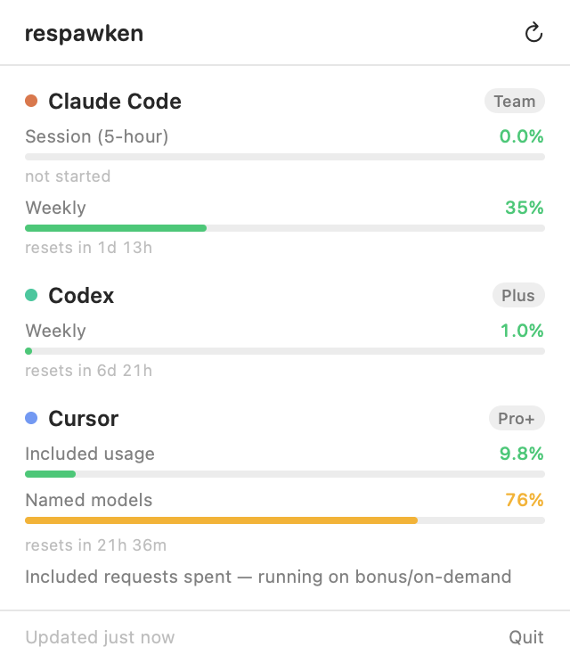

# respawken

A tiny macOS status bar app that shows how much Claude Code, Codex, and Cursor usage you have
left, and when each limit resets.

It answers two questions at a glance:

- **When do my limits reset?**
- **How much usage do I have left?**

Native Swift/SwiftUI, no Dock icon, ~22 MB resident, idle at 0% CPU.



The menu bar icon is three stacked meters — Claude, Codex, Cursor, top to bottom. Fill is
utilization, colour is severity (green / amber / red). A provider that is signed out or failing
renders as an empty outline, so a missing reading never looks like a healthy zero.

## Run it

```sh
./build.sh --run
```

That produces `dist/Respawken.app` and launches it. Move the bundle wherever you like; to have it
start with the machine, add it under System Settings → General → Login Items.

Two extra modes are useful when something looks wrong:

```sh
./build.sh && ./dist/Respawken.app/Contents/MacOS/Respawken --probe     # print live values
./dist/Respawken.app/Contents/MacOS/Respawken --preview /tmp/panel.png  # render the UI to a PNG
```

## Where the numbers come from

Everything is read on-device from credentials the three tools already store. respawken never asks
you to log in again and stores nothing of its own.

| Provider | Source | Notes |
| --- | --- | --- |
| **Codex** | `~/.codex/auth.json` → `chatgpt.com/backend-api/wham/usage` | Falls back to the `rate_limits` block in the newest session log in `~/.codex/sessions`, so it still shows last-known values offline. |
| **Cursor** | `state.vscdb` → `cursor.com/api/usage-summary` | Reuses the bearer token Cursor.app already holds, so no browser cookie decryption. Cursor bills monthly, so "resets" is the end of the billing cycle. |
| **Claude Code** | `~/.claude/.credentials.json` or the `Claude Code-credentials` Keychain item → `api.anthropic.com/api/oauth/usage` | Requires `claude auth login`. Access tokens expire after ~8 hours; respawken refreshes them via `platform.claude.com/v1/oauth/token` and writes the rotated tokens back so Claude Code stays in sync. The usage endpoint returns no account email. |

Providers are polled every 2 minutes, concurrently, with a 12-second timeout each. One provider
being slow or signed out never blocks the others.

### Two things worth knowing

**Cursor's state database is ~3 GB.** It's opened read-only with SQLite's `immutable=1`, which
skips locking and WAL recovery entirely. A point lookup returns in ~13 ms and never touches the
copy that Cursor itself is writing.

**Claude's credentials are read via `/usr/bin/security`, not `SecItemCopyMatching`.** Asking for
that Keychain item in-process raises an authorization prompt and takes ~8 seconds. Worse, macOS
pins the resulting "Always Allow" grant to the binary's code hash, so every rebuild prompts
again — signing with a real certificate and a hash-free designated requirement does not change
that (tested, it doesn't).

Claude Code's item already grants access to Apple's `security` tool, so shelling out to it reads
the same secret in ~20 ms and never prompts, on any build. The modification-date check is still
there to avoid spawning a process on every poll.

**Claude access tokens expire after ~8 hours.** Without a refresh, overnight polls hit 401 and
the panel asked you to re-login every morning even though the refresh token was still valid for
weeks. respawken now refreshes via Claude Code's public OAuth client
(`platform.claude.com/v1/oauth/token`) when the access token is expired or near expiry, and
writes the rotated tokens back to the Keychain so the CLI and the menu bar stay on the same
session. Cloudflare on that host bans non-CLI user agents, so the request uses the installed
`claude` version string as its User-Agent.

**429s are treated as soft failures.** A rate-limited poll keeps the last good reading instead of
blanking the provider.

## Layout

```
Sources/Respawken/
  App.swift           MenuBarExtra entry point
  Store.swift         polling, concurrency, refresh cadence
  Model.swift         UsageWindow / ProviderSnapshot, formatting
  MenuBarIcon.swift   the three-meter status icon
  PanelView.swift     the dropdown
  Probe.swift         --probe and --preview
  Providers/          one file per provider
  Support/Sources.swift  Keychain, SQLite, JWT, HTTP, tolerant JSON accessors
```

Prior art: [CodexBar](https://github.com/steipete/CodexBar), which supports ~29 providers. This
tracks three and aims to stay boring.
